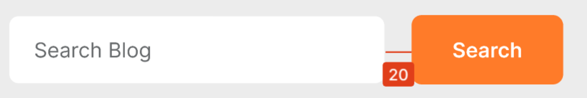
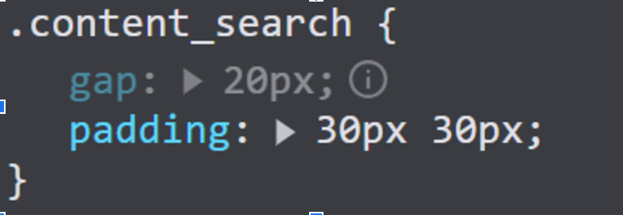
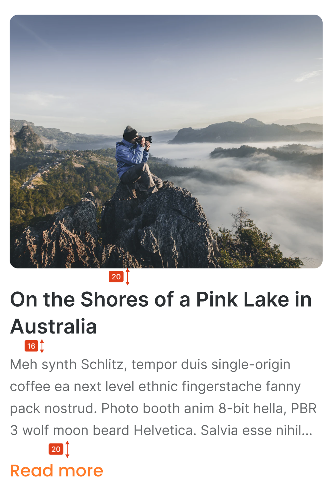

# Review Code - Hoàng Anh Dũng - Mid Test
# Điểm: 5.5/10
## **Phần Header**
1. **Cách trang trí Header**:
   - Header cần cách trên một khoảng **36px** so với trang web.

2. **Thẻ `<li>`**:
   - Không nên fix cứng `width` của thẻ `<li>` để tránh việc phần `gap` của `flex` không khớp với thuộc tính CSS.

3. **Thẻ `<a>`**:
   - Thiếu thuộc tính `href`.

4. **Hiệu ứng hover**:
   - Chưa thêm hiệu ứng `hover` cho các **nav links** của Header.

5. **CSS của Button**:
   - Button trong Header đang bị CSS sai.
   - Font-family cần sử dụng **Poppins**, không phải **Arial**.

6. **Thẻ ``**:
   - Thiếu thuộc tính `alt`.

7. **Flex và khoảng cách**:
   - Đang sử dụng `gap` nhưng chưa thiết lập `flex`, dẫn đến khoảng cách hiển thị sai so với thiết kế.
   
   

---

## **Blog**
- Khoảng cách nội dung của blog chưa đúng với thiết kế do chưa reset CSS **(Sử dụng reset.css nhưng command hết toàn bộ thuộc tính)**.
- Khoảng cách và màu sắc của nút **“Read more”** không đúng theo thiết kế.

   

## **Phần Search Button**
- **Sai CSS**:
  - Button Search không có `border`.
  - Màu sắc chưa đúng theo thiết kế.

---

## **Phần Footer**
- **Thiếu phần Footer** trong bài làm.

---

### **Chỉnh Sửa**
- Kiểm tra và chỉnh lại khoảng cách, font-family, màu sắc, và các thuộc tính còn thiếu như `hover`, `href`, `alt`.
- Thêm phần Footer để hoàn thiện thiết kế.

