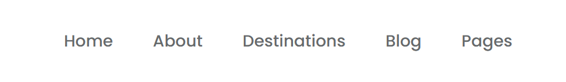

# Review Code - Hoàng Quang Thắng - Mid Test
## Điểm: 6.75/10

## **Điểm tốt**
1. **Hoàn thiện được nhiều phần cơ bản**:
   - Có đầy đủ các thành phần chính như Header, Banner, Content, Blog, và Footer.
2. **Footer đã được triển khai**:
   - Mặc dù chưa hoàn chỉnh, nhưng đã có phần Footer để người xem thấy cấu trúc cơ bản.
3. **Bố cục tương đối ổn định**:
   - Các thành phần chính được sắp xếp hợp lý, không bị chồng chéo.

---

## **Điểm cần cải thiện**

### **1. Hiệu ứng hover trên nav links**
- Khi hover vào **nav links**, chưa có hiệu ứng **gạch chân dưới text**.

### **2. Banner**
- **Banner** chưa giống thiết kế:
  - Chưa sử dụng `background-image` để tạo nền.

### **3. Input Search Blog**
- **Input Search** cần:
  - Thêm `padding-left` để nội dung nhập cách lề trái.
  - Sử dụng thuộc tính `type="search"` để đúng ngữ nghĩa.

### **4. Button Search**
- Thiếu `font-weight`, không đồng bộ với thiết kế.

### **5. Khoảng cách Content và Blog**
- Khoảng cách giữa **Content** và **Blog** quá xa so với thiết kế.

### **6. Button See More**
- Kích thước **Button See More** lớn hơn so với thiết kế.
- Thiếu hiệu ứng **shadow**.

### **7. Footer**
- Phần Footer có một số lỗi:
  - Nội dung Footer không đúng theo thiết kế.
  - Thẻ `
` không chiếm hết chiều rộng (width) của Footer.
  - Phần thứ hai của Footer chưa được CSS hoàn chỉnh.
  
### **8. Khoảng cách giữa các phần của Blog**
- Khoảng cách giữa các phần của **Blog** chưa có, không đúng so với thiết kế.

---

## **Ví dụ các lỗi**

### **Hover nav links (chưa có gạch chân)**

### **Banner (chưa dùng background-image)**

### **Input Search Blog**

### **Khoảng cách Content và Blog**

### **Button See More (to hơn thiết kế, thiếu shadow)**

### **Khoảng cách giữa các phần của Blog**

### **Footer (thẻ `
` không đúng, CSS chưa hoàn thiện)**

---
