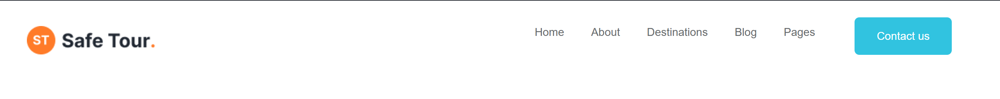
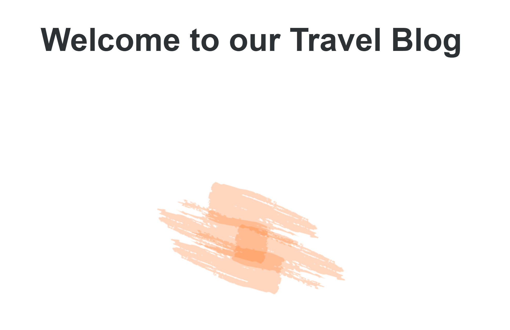
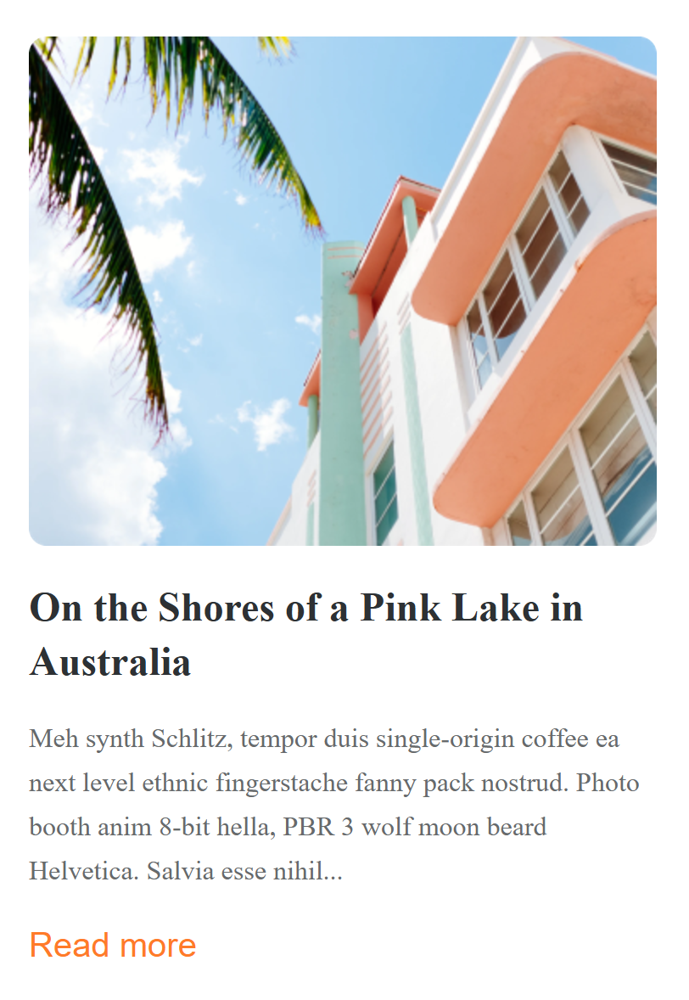
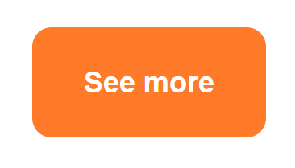

# Review Code - Kiều Minh Tuệ - Mid Test
## Điểm: 5/10

## **Điểm tốt**
**Hoàn thiện các thành phần cơ bản**:
   - Bao gồm Header, Banner, Content, Blog, và Footer.

---

## **Điểm cần cải thiện**

### **1. Header**
- CSS của Header hiện tại đang sai so với thiết kế.
- Font-family của button "Contact Us" không đúng theo yêu cầu thiết kế.

---

### **2. Banner**
- CSS Banner không đúng:
  - Nên sử dụng **background-image** để phù hợp hơn với thiết kế.

---

### **3. Content**
- Phần Content đang sai:
  - **Font-family** và **font-size** không giống thiết kế.
  - Khoảng cách giữa các phần tử không đúng.
  

---

### **4. Blog**
- Đang sử dụng sai **font-family**, cần thay đổi để đồng bộ với thiết kế.

---

### **5. Button “See More”**
- Button thiếu **shadow**, làm không giống thiết kế.

### **6. Thiếu Footer**
- Chưa hoàn thiện phần Footer.
---

## **Gợi ý hoàn thiện**
1. Chỉnh sửa **CSS Header** để đúng với thiết kế và sử dụng đúng **font-family**.
2. Sử dụng **background-image** để cải thiện phần Banner.
3. Kiểm tra lại **font-family**, **font-size**, và **khoảng cách** trong Content và Blog.
4. Thêm shadow cho button “See More” để giống thiết kế.

---

