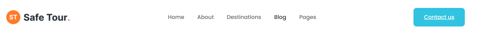
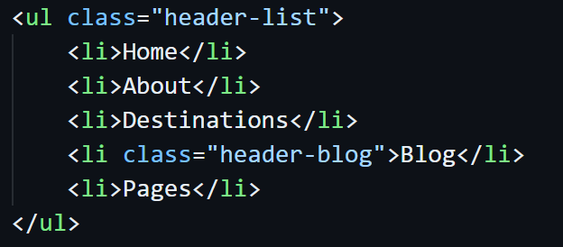
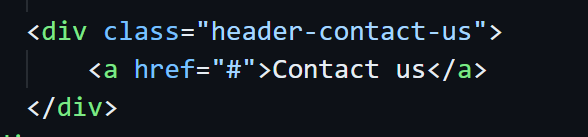
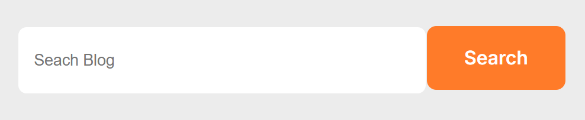
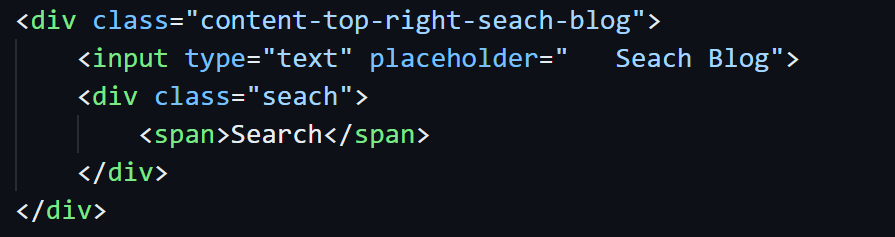
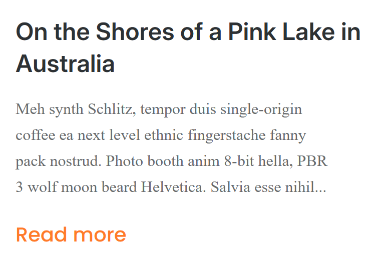
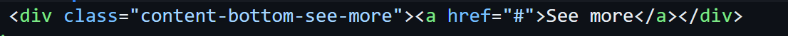
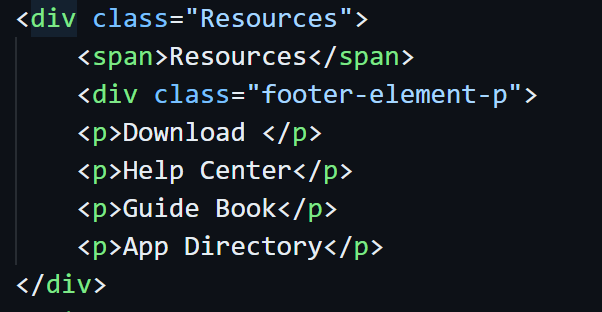

# Review Code - Lê Văn Minh - Mid Test
## Điểm: 6.5/10

## **Điểm tốt**
1. **Cấu trúc cơ bản đầy đủ**:
   - Bao gồm các phần chính như Header, Banner, Content, Blog, và Footer.
2. **Bố cục dễ nhìn**:
   - Các phần trong giao diện được chia rõ ràng, giúp dễ dàng đọc và hiểu cấu trúc.

---

## **Điểm cần cải thiện**

### **1. Header**
- **Sử dụng thẻ `<nav>` để bọc danh sách `<ul> <li>`**:
  - Tăng tính ngữ nghĩa cho danh sách link chuyển trang.
- **Hiệu ứng hover**:
  - Chưa có hiệu ứng khi hover vào các liên kết, không giống thiết kế.

### **2. Button “Contact Us”**
- Hiện tại sử dụng thẻ `
` thay vì `<button>`, không đúng ngữ nghĩa.
  

### **3. Banner**
- Chưa sử dụng **background-image**, làm phần Banner không giống thiết kế.
  

### **4. Input và Button Search**
- **Form** chưa được sử dụng:
  - Nên bọc `<input>` và `<button>` trong thẻ `<form>` để hợp lý hơn.
- Thiếu **thuộc tính name** cho thẻ `<input>`, điều này quan trọng khi xử lý dữ liệu nhập.
- Button "Search" nên sử dụng thẻ `<button>` thay vì `
`.
- Khoảng cách giữa **input** và **button** cần chỉnh lại thành **20px** để giống thiết kế.

### **5. Thẻ ``**
- Nội dung thuộc tính `alt` không nên là ký tự `#`, cần mô tả ngắn gọn ý nghĩa của hình ảnh.
- Đây là Blog, nên dùng thẻ `<a>` thay vì `
` để tạo liên kết phù hợp hơn.

### **6. Blog Description**
- Phần mô tả Blog chưa áp dụng **font-family** đúng theo thiết kế.
  

### **7. Button “See More”**
- Nên đặt trong thẻ `<button>` thay vì sử dụng thẻ `
` để đúng ngữ nghĩa.

### **8. Footer**
- **Sử dụng thẻ `<nav>`**:
  - Khi liệt kê danh sách chuyển hướng bằng `<ul> <li>`, cần bọc trong thẻ `<nav>` để tăng tính ngữ nghĩa và hỗ trợ Accessibility.
  - Thiếu một phần của Footer
  
  

---
