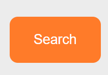
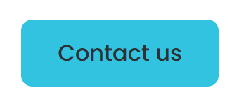
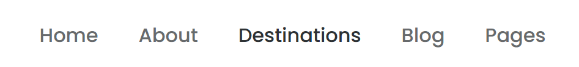
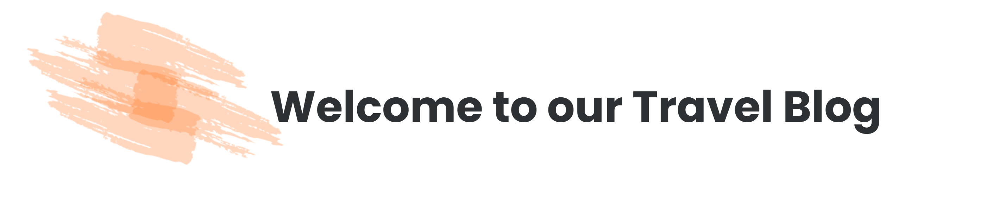
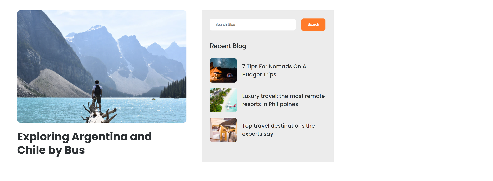
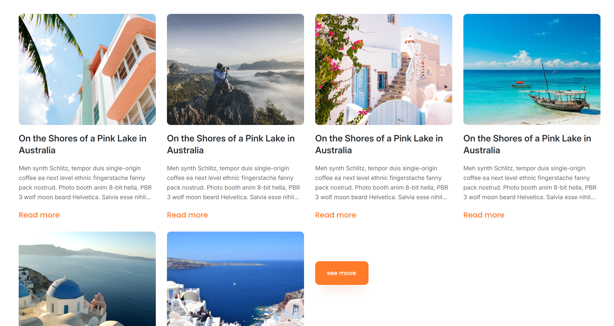
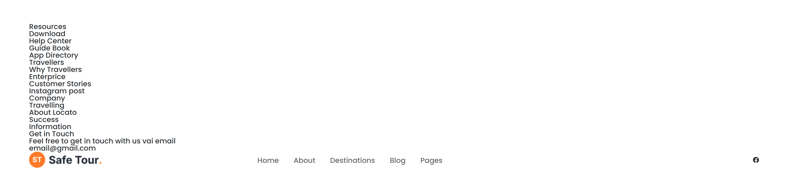

# Review Code - Nguyễn Trường Thông - Mid Test
## Điểm: 5.5

## **Những lỗi cần sửa**

### **1. Button Contact Us**
- Sai màu sắc so với thiết kế.

### **2. Hiệu ứng hover trên nav links**
- Khi hover vào **nav links**, chưa có hiệu ứng **gạch chân dưới text**.

### **3. Banner**
- **Banner** chưa giống thiết kế:
  - Chưa sử dụng `background-image` để tạo nền.

### **4. Button Search**
- **Button Search** thiếu `font-weight`, dẫn đến không đồng bộ với thiết kế.
  

### **5. Content**
- Nội dung chưa được căn giữa đúng như thiết kế.

### **6. Phần Blog**
- Số lượng bài viết trong Blog không đúng:
  - Thiết kế yêu cầu hiển thị **3 bài viết**, nhưng bài làm hiển thị **4 bài**.

### **7. Footer**
- Chưa làm xong phần **Footer**.

### **8. Tổng quan**
- Bài làm còn khá **lộn xộn** và chưa hoàn chỉnh.

---

## **Ví dụ các lỗi**

### **Button Contact Us (sai màu)**

### **Hiệu ứng hover trên nav links**

### **Banner (chưa dùng background-image)**

### **Content chưa căn giữa**

### **Phần Blog (thừa bài viết)**

### **Footer chưa làm xong**

---

