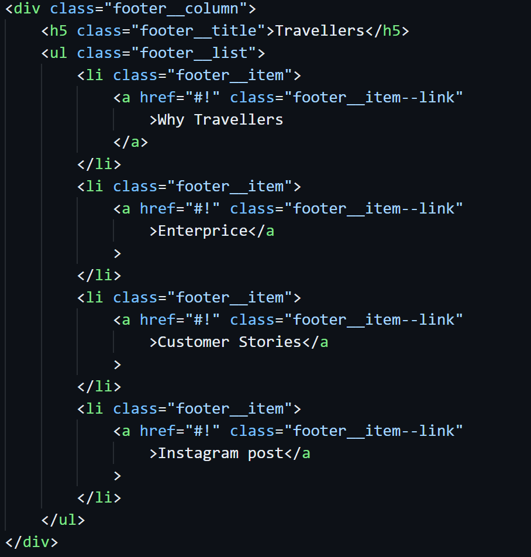
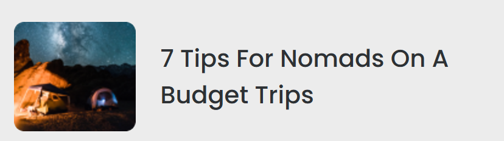

# Review Code - Nguyễn Văn Sơn - Mid Test
## Điểm: 9.5/10

## **Điểm tốt**
1. **Bài làm rất tốt**:
   - Bám theo yêu cầu của thiết kế.
2. **Đầy đủ thuộc tính**:
   - Các thẻ HTML đã dùng đầy đủ các thuộc tính.

---

## **Điểm cần cải thiện**

### **Footer và Thẻ `<nav>`**
- Khi sử dụng danh sách `<ul><li>` để liệt kê danh sách liên kết chuyển hướng, cần đặt bên trong thẻ `<nav>` để đảm bảo:
  - **Tính ngữ nghĩa** trong HTML.
  - Hỗ trợ **Accessibility (Khả năng truy cập)**, đặc biệt với các công cụ hỗ trợ như trình đọc màn hình.
  

### **Blog**
- Cần sử dụng thẻ `<a>` để chuyển đến Blog không nên sử dụng thẻ `<h4>`.
  

---

